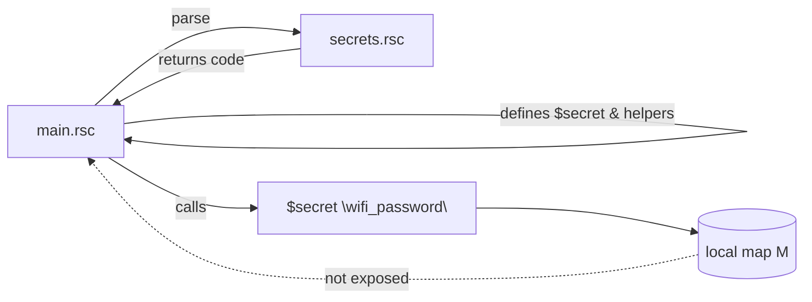

# Secjector - secrets injector for MikroTik RouterOS `.rsc`

> **Tagline:** *Tiny, local-only secrets accessor for RouterOS scripts. One-liner to load. Zero globals. Flat YAML in, `$secret "key"` out.*

 

Secjector helps you use secrets in RouterOS scripts **without** leaking them to global scope. Secrets live only inside a helper function at call-time. Default behavior fails fast if a key is missing.

## Why Secjector?
- **One-line injection** in your `.rsc`.
- **No `/system/script/environment`**.
- **No global maps** in caller scope.
- **Flat YAML input**, supports multiline via `|` blocks.
- **Configurable missing-key policy**: `error` (default) or `warn`.

## Quick start

**examples/main.rsc**
```rsc
# optional: switch to warnings
# :local __secret__handling__mode "warn"

# one-line injection
[:parse [[:parse [/file get "secrets.rsc" contents]]]]

# validate and use
[$secret_require {"wifi_password";"api_key"}]
/user add name="ops" group=full password=[$secret "wifi_password"]
```

**examples/secrets.yaml**
```yaml
wifi_password: my_super_secret_password
api_key: "some long key with spaces"
cert_pem: |
  -----BEGIN CERTIFICATE-----
  MIIB...snip...
  -----END CERTIFICATE-----
```

## Hyphens, underscores, and quoting

Use string keys with quotes for reliability:

- `[$secret "wifi_password"]` - good
- `[$secret "wifi-password"]` - good (hyphen allowed in YAML key)
- `[$secret wifi_password]` - only if you defined `:local wifi_password "wifi_password"` first (not recommended)
- `[$secret wifi-password]` - will NOT work (bare token with hyphen is not a valid variable name)

**Rule:** always quote the key string you pass to `$secret`.

## CI smoke test

We provide `.github/workflows/chr-smoke.yml` that boots CHR under QEMU (no KVM) and runs a tiny smoke test via SSH. Details in **docs/ci.md**.

## Install

```bash
git clone https://github.com/REPLACE_ORG/secjector
cd secjector
# optional docs build:
make docs
```

## Versioning

- SemVer starting at **v0.1.x**.
- Current: **v0.1.2**

## Roadmap (short)

- v0.2: optional `/tool fetch` support for `http/https` sources (presigned URL), ephemeral file, then delete.
- Optional checksum print (keys+lengths) for verification.
- Optional masked logging in `warn` mode.

## Mermaid overview


## License

MIT © 2025
