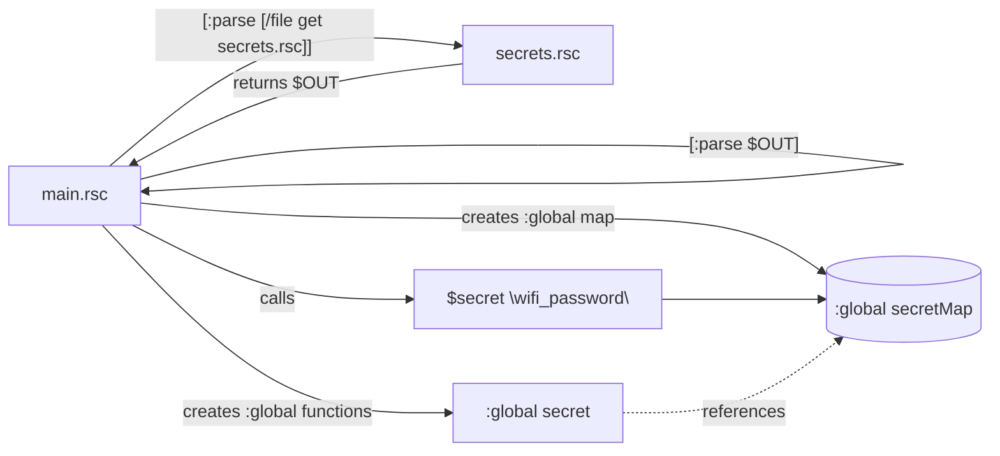

# Secjector - secrets injector for MikroTik RouterOS `.rsc`

> **Tagline:** *Tiny secrets accessor for RouterOS scripts. Two-liner to load. Flat YAML in, `$secret "key"` out.*

  

Secjector helps you use secrets in RouterOS scripts with a simple injection pattern. Tested on bare metal RouterOS 7.20.x hardware. Default behavior fails fast if a key is missing.

**✅ Tested on RouterOS 7.20.2 (ARM) - MikroTik hAP ac²**

## Why Secjector?
- **Two-line injection** in your `.rsc` (tested on RouterOS 7.20.x)
- **Supports keys with colons, spaces, and special characters** (e.g., `colon:key`, `space key`, `@leading`)
- **No `/system/script/environment`** required
- **Flat YAML input**, supports multiline via `|` blocks
- **Configurable missing-key policy**: `error` (default) or `warn`

## Quick start

**examples/main.rsc**
```rsc
# Two-line injection (RouterOS 7.20.x compatible)
[:parse [/file get "secrets.rsc" contents]]
[:parse $OUT]

# Validate and use (note: camelCase function names for RouterOS 7.20.x)
[$secretRequire {"wifi_password";"api_key"}]
/user add name="ops" group=full password=[$secret "wifi_password"]

# For storing values, use :global (RouterOS 7.20.x limitation)
:global myPass [$secret "wifi_password"]
```

**examples/secrets.yaml**
```yaml
wifi_password: my_super_secret_password
api_key: "some long key with spaces"
cert_pem: |
  -----BEGIN CERTIFICATE-----
  MIIB...snip...
  -----END CERTIFICATE-----
```

## Hyphens, underscores, and quoting

Use string keys with quotes for reliability:

- `[$secret "wifi_password"]` - good
- `[$secret "wifi-password"]` - good (hyphen allowed in YAML key)
- `[$secret wifi_password]` - only if you defined `:local wifi_password "wifi_password"` first (not recommended)
- `[$secret wifi-password]` - will NOT work (bare token with hyphen is not a valid variable name)

**Rule:** always quote the key string you pass to `$secret`.

## RouterOS 7.20.x Compatibility

Secjector has been extensively tested and fixed for RouterOS 7.20.x on bare metal hardware. Key changes for compatibility:

### Function Names
- ✅ `$secret` - Get secret value
- ✅ `$secretHas` - Check if secret exists (renamed from `secret_has`)
- ✅ `$secretRequire` - Validate required secrets (renamed from `secret_require`)
- ❌ `$secretCleanup` - Disabled (RouterOS 7.20.x cannot `:set` function variables)

### Usage Pattern
```rsc
# Use :parse, NOT /import (imports run in isolated scope)
[:parse [/file get "secrets.rsc" contents]]
[:parse $OUT]

# Direct usage in expressions works:
/user add password=[$secret "wifi_password"]

# To store values, use :global (NOT :local):
:global myPass [$secret "wifi_password"]  # ✅ Works
:local myPass [$secret "wifi_password"]   # ❌ Returns empty
```

### Limitations
- **Cannot use `:local` for storing function return values** - use `:global` or direct expressions
- **Cannot use `/import`** - use `:parse [/file get ...]` pattern instead
- **`secretCleanup` not available** - RouterOS 7.20.x limitation

## CI smoke test

We provide `.github/workflows/chr-smoke.yml` that boots CHR under QEMU (no KVM) and runs a tiny smoke test via SSH. Details in **docs/ci.md**.

## Install

```bash
git clone https://github.com/REPLACE_ORG/secjector
cd secjector
# optional docs build:
make docs
```

## Versioning

- SemVer starting at **v0.1.x**.
- Current: **v0.1.3** (RouterOS 7.20.x compatibility update)

## Roadmap (short)

- v0.2: optional `/tool fetch` support for `http/https` sources (presigned URL), ephemeral file, then delete.
- Optional checksum print (keys+lengths) for verification.
- Optional masked logging in `warn` mode.

## Mermaid overview


## License

MIT © 2025
