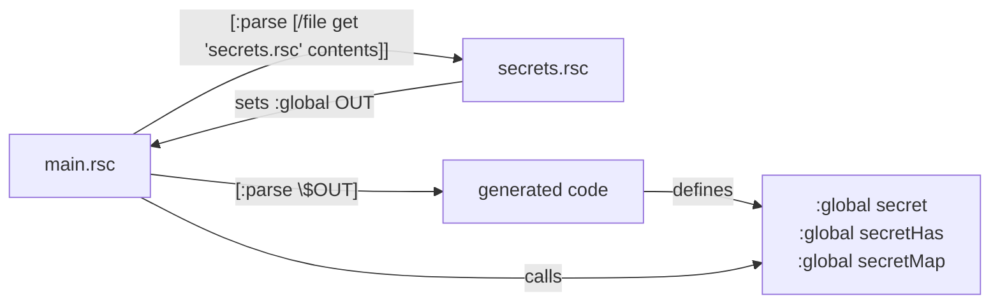

# Secjector — secrets injector for MikroTik RouterOS `.rsc`

> *Tiny secrets accessor for RouterOS scripts. Two lines to load. Flat YAML in, `$secret "key"` out.*


Secjector helps you use secrets in RouterOS scripts. Load `secrets.rsc` with two `:parse` calls; it exposes `$secret`, `$secretHas`, and `$secretRequire` as `:global` functions. Default behaviour fails fast on a missing key.

## Why Secjector?

- **Two-line injection** — no `/import`, no custom packages
- **Flat YAML input** — multiline `|` blocks supported
- **Special-character keys** — colons, spaces, `@`, hyphens all work when quoted
- **No `/system/script/environment`** required
- **Configurable missing-key policy** — `error` (default) or `warn`

## Quick start

**`secrets.yaml`**
```yaml
wifi_password: my_super_secret_password
api_key: "some long key with spaces"
cert_pem: |
  -----BEGIN CERTIFICATE-----
  MIIB...snip...
  -----END CERTIFICATE-----
```

**`main.rsc`**
```rsc
# Load secrets (two separate :parse calls — they cannot be nested)
[:parse [/file get "secrets.rsc" contents]]
[:parse $OUT]

# Use directly in expressions (preferred)
/user add name="ops" group=full password=[$secret "wifi_password"]

# Or store in a local variable
:local pass [$secret "wifi_password"]
```

## Key quoting rules

Always pass a quoted string key to `$secret`:

| Call | Works? | Notes |
|------|--------|-------|
| `[$secret "wifi_password"]` | ✅ | recommended |
| `[$secret "space key"]` | ✅ | quoted handles spaces |
| `[$secret "colon:key"]` | ✅ | quoted handles colons |
| `[$secret wifi_password]` | ⚠️ | only if `$wifi_password` variable is defined |
| `[$secret wifi-password]` | ❌ | bare hyphen token is invalid |

## RouterOS compatibility

Secjector targets RouterOS 7.20+. CI runs against CHR 7.22 (`mikrotik/chr:stable`) on every push.

### Available functions

| Function | Purpose |
|----------|---------|
| `$secret "key"` | Returns the value; errors if missing (or warns in `warn` mode) |
| `$secretHas "key"` | Boolean — `true` if the key exists and is non-empty |
| `$secretRequire` | Validates a list of keys; errors/warns if any are missing |

`$secretCleanup` is **not available** — RouterOS cannot `:set` a `:global` function variable.

### Known constraints

- Use `:parse [/file get ...]`, **not** `/import` — imports run in an isolated scope where globals do not persist
- The two `:parse` calls **cannot** be nested into one line — RouterOS global scope does not propagate across nested `:parse` boundaries
- All generated functions and the secret map are `:global`

### Modes

```rsc
:local secretHandlingMode "warn"   # set before loading; default is "error"
[:parse [/file get "secrets.rsc" contents]]
[:parse $OUT]
```

## CI

`.github/workflows/chr-smoke.yml` boots the official `mikrotik/chr:stable` Docker image (RouterOS 7.22) with KVM acceleration on every push and PR to `main`. It copies `secrets.rsc` and `tests/secrets.yaml` to the router over SSH, runs the integration script, and asserts the exact expected result string.

## Install

```bash
git clone https://github.com/bpopovych/secjector
cd secjector
make test        # unit + regression checks
make docs        # optional MkDocs site
```

## Architecture


```mermaid
flowchart LR
  A[main.rsc] -->|"[:parse [/file get 'secrets.rsc' contents]]"| B[secrets.rsc]
  B -->|"sets :global OUT"| A
  A -->|"[:parse \$OUT]"| C[generated code]
  C -->|"defines"| D[":global secret\n:global secretHas\n:global secretMap"]
  A -->|calls| D
```

## Roadmap

- v0.2: `/tool fetch` support for HTTP/HTTPS sources (presigned URL), ephemeral file, then delete
- Optional checksum print (key lengths) for verification
- Optional masked logging in `warn` mode

## License

MIT © 2025
